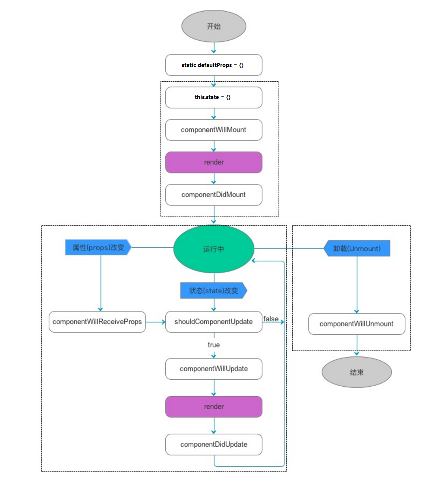
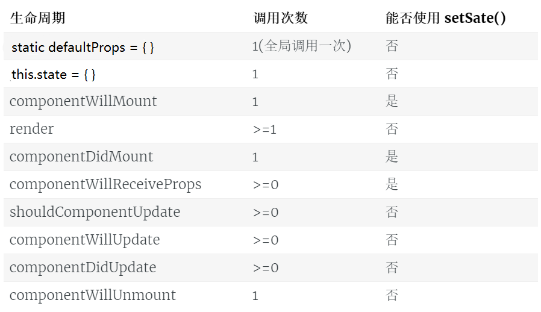

# 移动App第4天


## 组件的生命周期
 + 概念：在组件创建、到加载到页面上运行、以及组件被销毁的过程中，总是伴随着各种各样的事件，这些在组件特定时期，触发的事件，统称为 组件的生命周期；
 + 组件生命周期分为三部分：
   - **组件创建阶段**：组件创建阶段的生命周期函数，有一个显著的特点：创建阶段的生命周期函数，在组件的一辈子中，只执行一次；
	> componentWillMount: 组件将要被挂载，此时还没有开始渲染虚拟DOM
	> render：第一次开始渲染真正的虚拟DOM，当render执行完，内存中就有了完整的虚拟DOM了
	> componentDidMount: 组件完成了挂载，此时，组件已经显示到了页面上，当这个方法执行完，组件就进入都了 运行中 的状态

   - **组件运行阶段**：也有一个显著的特点，根据组件的state和props的改变，有选择性的触发0次或多次；
   > componentWillReceiveProps: 组件将要接收新属性，此时，只要这个方法被触发，就证明父组件为当前子组件传递了新的属性值；
   > shouldComponentUpdate: 组件是否需要被更新，此时，组件尚未被更新，但是，state 和 props 肯定是最新的
   > componentWillUpdate: 组件将要被更新，此时，尚未开始更新，内存中的虚拟DOM树还是旧的
   > render: 此时，又要重新根据最新的 state 和 props 重新渲染一棵内存中的 虚拟DOM树，当 render 调用完毕，内存中的旧DOM树，已经被新DOM树替换了！此时页面还是旧的
   > componentDidUpdate: 此时，页面又被重新渲染了，state 和 虚拟DOM 和 页面已经完全保持同步

   - **组件销毁阶段**：也有一个显著的特点，一辈子只执行一次；
   > componentWillUnmount: 组件将要被卸载，此时组件还可以正常使用；

[vue中的生命周期图](https://cn.vuejs.org/v2/guide/instance.html#生命周期图示)
[React Native 中组件的生命周期](http://www.race604.com/react-native-component-lifecycle/)




### defaultProps
> 在组件创建之前，会先初始化默认的props属性，这是全局调用一次，严格地来说，这不是组件的生命周期的一部分。在组件被创建并加载候，首先调用 constructor 构造器中的 this.state = {}，来初始化组件的状态。

```
static defaultProps = { initcount : 0} //React中，使用静态的defaultProps传递默认值
```


React生命周期的回调函数总结成表格如下：

组件生命周期的执行顺序：
+ Mounting：
 - constructor()
 - componentWillMount()
 - render()
 - componentDidMount()
+ Updating：
 - componentWillReceiveProps(nextProps)
 - shouldComponentUpdate(nextProps, nextState)
 - componentWillUpdate(nextProps, nextState)
 - render()
 - componentDidUpdate(prevProps, prevState)
+ Unmounting：
 - componentWillUnmount()

## 通过Counter计数器的小案例 - 了解生命周期函数
1. 给组件设置默认属性：static propTypes = {} 这是传一个对象，可以把外界传递过来的属性，做类型校验。

2. 给属性进行类型校验，需要先运行`cnpm i prop-types --save`( v.15.*现在已经安装好了 )

   ```
   import ReactTypes from 'prop-types' //定义了一些类型
   static propTypes = {
   	initcount: ReactTypes.number //使用 prop-types提供的类型校验
   }
   ```

   


## 组件初始化时生命周期事件总结
1. componentWillMount：
2. render：
3. componentDidMount：
4. 注意：在render函数中，不能调用`setState()`方法

## 通过原生的方式获取元素并绑定事件


## React中使用ref属性获取DOM元素引用


## 使用React中的事件，绑定count自增


## 组件运行中事件的对比
1. shouldComponentUpdate：
2. componentWillUpdate：
3. render：
4. componentDidUpdate：


## 绑定this并传参的三种方式
1. 在事件中绑定this并传参：
```
    <input type="button" value="在事件中绑定this并传参" onClick={this.handleMsg1.bind(this, '🍕', '🍟')} />

    // 在事件中绑定this并传参
    handleMsg1(arg1, arg2) {
        console.log(this);
        // 此时this是个null
        this.setState({
            msg: '在事件中绑定this并传参：' + arg1 + arg2
        });
    }
```
2. 在构造函数中绑定this并传参:
```
    // 修改构造函数中的代码：
    this.handleMsg2 = this.handleMsg2.bind(this, '🚗', '🚚');

    <input type="button" value="在构造函数中绑定this并传参" onClick={this.handleMsg2} />

    // 在构造函数中绑定this并传参
    handleMsg2(arg1, arg2) {
        this.setState({
            msg: '在构造函数中绑定this并传参：' + arg1 + arg2
        });
    }
```
3. 用箭头函数绑定this并传参：
```
    <input type="button" value="用箭头函数绑定this并传参" onClick={() => { this.handleMsg3('👩', '👰') }} />

    // 用箭头函数绑定this并传参
        handleMsg3(arg1, arg2) {
            this.setState({
                msg: '用箭头函数绑定this并传参：' + arg1 + arg2
            });
        }
```

## 绑定文本框与state中的值
1. 在Vue.js中，默认可以通过`v-model`指令，将表单控件和我们的`data`上面的属性进行双向数据绑定，数据变化和页面之间的变化是同步的！
2. 在React.js中，默认没有提供双向数据绑定这一功能，默认的，只能把`state`之上的数据同步到界面的控件上，但是不能默认实现把界面上数据的改变，同步到`state`之上，需要程序员手动调用相关的事件，来进行逆向的数据传输！
3. 绑定文本框和state的值：
```
    {/*只要将value属性，和state上的状态进行绑定，那么，这个表单元素就变成了受控表单元素，这时候，如果没有调用相关的事件，是无法手动修改表单元素中的值的*/}
    <input style={{ width: '100%' }} ref="txt" type="text" value={this.state.msg} onChange={this.handleTextChange} />

    // 这是文本框内容改变时候的处理函数
    handleTextChange = () => {
        this.setState({
            msg: this.refs.txt.value
        });
    }
```
4. 注意`setState的一个问题`：
```
// 保存最新的state状态值，在保存的时候，是异步地进行保存的，所以，如果想要获取最新的，刚刚保存的那个状态，需要通过回掉函数的形式去获取最新state
this.setState({
    msg: this.refs.txt.value
    // msg: e.target.value
}, function () {
    // 获取最新的state状态值
    console.log(this.state.msg);
});
```


## 发表评论案例


## 扩展
### context特性
记住一串单词组合`getChildContextTypes`
前3个、后3个、后两个
一个方法、两个静态属性


## 相关文章
[类型校验](https://facebook.github.io/react/docs/typechecking-with-proptypes.html)
[Animation Add-Ons](https://reactjs.org/docs/animation.html#high-level-api-reactcsstransitiongroup)